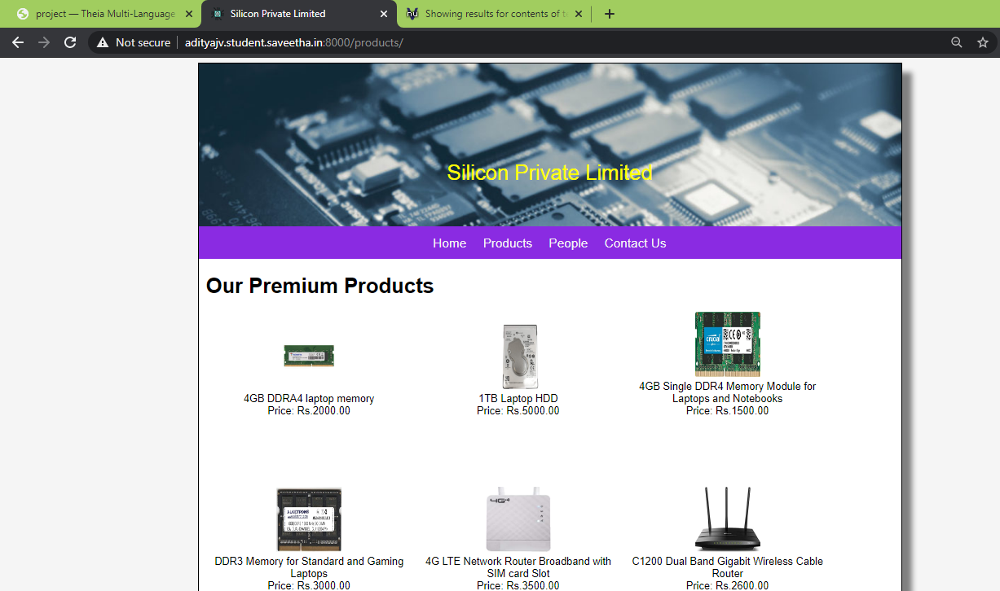
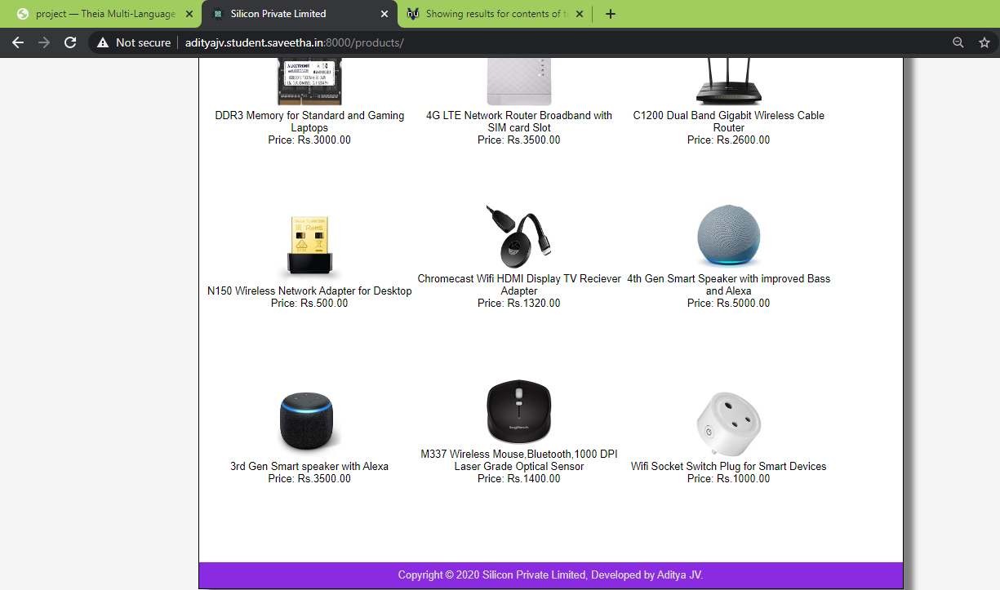
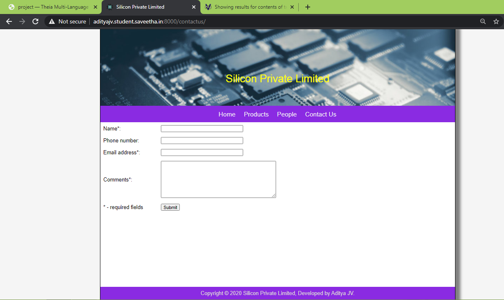
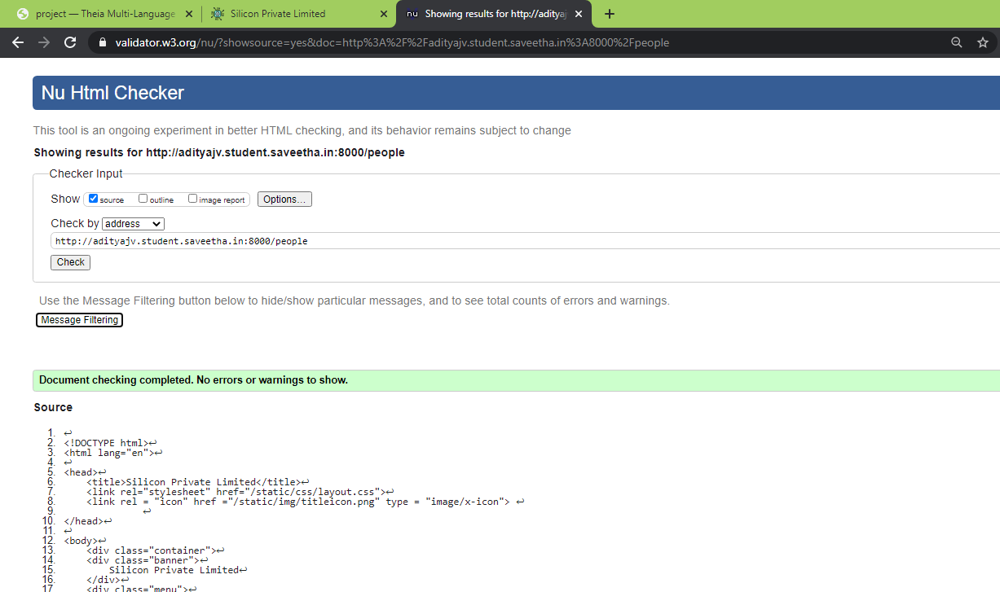
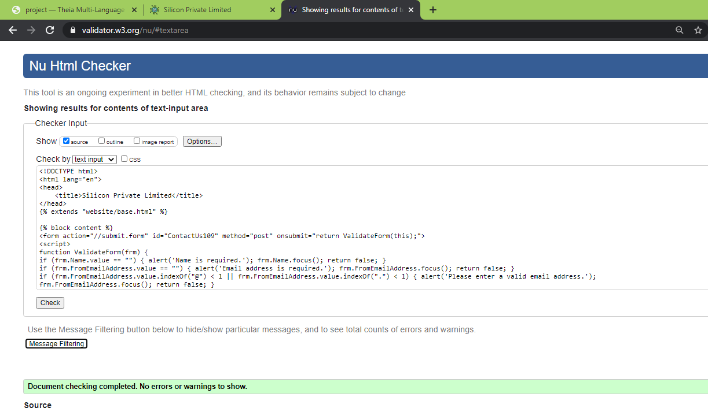

# Web Design for a Manufacturing Company
## AIM: 
To design a static website for a chip manufacturing company.

## DESIGN STEPS:
### Step 1: 
Requirement collection.
### Step 2:
Creating the layout using HTML and CSS.
### Step 3:
Updating the sample content.
### Step 4:
Choose the appropriate style and color scheme.
### Step 5:
Validate the layout in various browsers.
### Step 6:
Validate the HTML code.
### Step 6:
Publish the website in the given URL.

## PROGRAM:

### base.html
```

<!DOCTYPE html>
<html lang="en">

<head>
    <title>Silicon Private Limited</title>
    <link rel="stylesheet" href="">
    <link rel = "icon" href ="" type = "image/x-icon"> 
              
</head>

<body>
    <div class="container">
    <div class="banner">
        Silicon Private Limited.
    </div>
    <div class="menu">
        <div class="menuitem"><a href="/home">Home</a></div> 
        <div class="menuitem"><a href="/products">Products</a></div> 
        <div class="menuitem"><a href="/people">People</a></div>
        <div class="menuitem"><a href="/contactus">Contact Us</a></div> 
    </div><div class="content">
        
    
    </div>
    <div class="footer">
        Copyright © 2020 Silicon Private Limited, Developed by Aditya JV.
    </div>
    </div>
</body>

</html>
```

### home.html
```



    <div class="homecontent">    
    <h1>About Us</h1>
    
    <div class="contenttext">
    Silicon Pvt Ltd, provides a broad range of semiconductor and infrastructure software applications. Some of Silicon's core technologies and products include:
    <ul>
        <li>Memory Chips</li>
        <li>SATA HDD</li>
        <li>SATA SSD </li>
        <li>Broadband Modems</li>
        <li>Wifi Devices</li>
        <li>Switching Devices</li>
        <li>Optical Sensors</li>
    </ul> 
    </div>
    </div>

```
### products.html
```



    <div class="productcontent">    
    <h1>Our Premium Products</h1>
    <div class="productitems">
        <div class="productitem"> 
            <div class="itemimage">
            
            </div>
            <div class="itemname">4GB DDRA4 laptop memory</div>
            <div class="itemprice">Price: Rs.2000.00 </div>
        </div>
        <div class="productitem"> 
            <div class="itemimage">
            
            </div>
            <div class="itemname">1TB Laptop HDD</div>
            <div class="itemprice">Price: Rs.5000.00 </div>
        </div>
        <div class="productitem"> 
            <div class="itemimage">
            
            </div>
            <div class="itemname">4GB Single DDR4 Memory Module for Laptops and Notebooks</div>
            <div class="itemprice">Price: Rs.1500.00 </div>
        </div>
        <div class="productitem"> 
            <div class="itemimage">
            
            </div>
            <div class="itemname">DDR3 Memory for Standard and Gaming Laptops</div>
            <div class="itemprice">Price: Rs.3000.00 </div>
        </div>
        <div class="productitem"> 
            <div class="itemimage">
            
            </div>
            <div class="itemname">4G LTE Network Router Broadband with SIM card Slot</div>
            <div class="itemprice">Price: Rs.3500.00 </div>
        </div>
        <div class="productitem"> 
            <div class="itemimage">
            
            </div>
            <div class="itemname">C1200 Dual Band Gigabit Wireless Cable Router</div>
            <div class="itemprice">Price: Rs.2600.00 </div>
        </div>
        <div class="productitem"> 
            <div class="itemimage">
            
            </div>
            <div class="itemname">N150 Wireless Network Adapter for Desktop</div>
            <div class="itemprice">Price: Rs.500.00 </div>
        </div>
        <div class="productitem"> 
            <div class="itemimage">
            
            </div>
            <div class="itemname">Chromecast Wifi HDMI Display TV Reciever Adapter</div>
            <div class="itemprice">Price: Rs.1320.00 </div>
        </div>
        <div class="productitem"> 
            <div class="itemimage">
            
            </div>
            <div class="itemname">4th Gen Smart Speaker with improved Bass and Alexa</div>
            <div class="itemprice">Price: Rs.5000.00 </div>
        </div>
        <div class="productitem"> 
            <div class="itemimage">
            
            </div>
            <div class="itemname">3rd Gen Smart speaker with Alexa</div>
            <div class="itemprice">Price: Rs.3500.00 </div>
        </div>
        <div class="productitem"> 
            <div class="itemimage">
            
            </div>
            <div class="itemname">M337 Wireless Mouse,Bluetooth,1000 DPI Laser Grade Optical Sensor</div>
            <div class="itemprice">Price: Rs.1400.00 </div>
        </div>
        <div class="productitem"> 
            <div class="itemimage">
            
            </div>
            <div class="itemname">Wifi Socket Switch Plug for Smart Devices</div>
            <div class="itemprice">Price: Rs.1000.00 </div>
        </div>
    </div>
    </div>

```
### people.html
~~~



    <div class="peoplecontent">
    <h1>Our Team</h1>
    <div class="crewmembers">
        <div class="crewmember">
            <div class="memberimage">
                
            </div>
            <div class="membername">Vijay</div>
            <div class="designation">C.E.O</div>
        </div>
        <div class="crewmember">
            <div class="memberimage">
                
            </div>
            <div class="membername">Scarlett Johansson</div>
            <div class="designation">FRONTEND DEV</div>
        </div>
        <div class="crewmember">
            <div class="memberimage">
                
            </div>
            <div class="membername">Johnny Depp</div>
            <div class="designation">TECHNICAL TEAM</div>
        </div>
        <div class="crewmember">
            <div class="memberimage">
                
            </div>
            <div class="membername">Deepika</div>
            <div class="designation"> R & D HEAD </div>
        </div>
        <div class="crewmember">
            <div class="memberimage">
                
            </div>
            <div class="membername">Nayanthara</div>
            <div class="designation"> DESIGN TEAM </div>
        </div>
        <div class="crewmember">
            <div class="memberimage">
                
            </div>
            <div class="membername">Ajith Kumar</div>
            <div class="designation"> MARKETING HEAD </div>
        </div>
    </div>
    </div>

~~~
### contactus.html
~~~



<form action="//submit.form" id="ContactUs109" method="post" onsubmit="return ValidateForm(this);">
<script type="text/javascript">
function ValidateForm(frm) {
if (frm.Name.value == "") { alert('Name is required.'); frm.Name.focus(); return false; }
if (frm.FromEmailAddress.value == "") { alert('Email address is required.'); frm.FromEmailAddress.focus(); return false; }
if (frm.FromEmailAddress.value.indexOf("@") < 1 || frm.FromEmailAddress.value.indexOf(".") < 1) { alert('Please enter a valid email address.'); frm.FromEmailAddress.focus(); return false; }
if (frm.Comments.value == "") { alert('Please enter comments or questions.'); frm.Comments.focus(); return false; }
return true; }
</script>
<table style="width:100%;max-width:550px;border:0;" cellpadding="8" cellspacing="0">
<tr> <td>
<label for="Name">Name*:</label>
</td> <td>
<input name="Name" type="text" maxlength="60" style="width:100%;max-width:250px;" />
</td> </tr> <tr> <td>
<label for="PhoneNumber">Phone number:</label>
</td> <td>
<input name="PhoneNumber" type="text" maxlength="45" style="width:100%;max-width:250px;" />
</td> </tr> <tr> <td>
<label for="FromEmailAddress">Email address*:</label>
</td> <td>
<input name="FromEmailAddress" type="text" maxlength="90" style="width:100%;max-width:250px;" />
</td> </tr> <tr> <td>
<label for="Comments">Comments*:</label>
</td> <td>
<textarea name="Comments" rows="7" cols="40" style="width:100%;max-width:350px;"></textarea>
</td> </tr> <tr> <td>
* - required fields
</td> <td>
<input name="skip_Submit" type="submit" value="Submit" />
</td> </tr>
</table>
</form>

~~~
## OUTPUT:









## CODE VALIDATION REPORT:





## RESULT:
Thus a website is designed for the chip manufacturing company and is hosted in the URL http://adityajv.student.saveetha.in:8000/. HTML code is validated.